# Varphi: Developers Guide

## Background 

Before we can explain what Varphi is exactly, we must first recall some of the concepts from the theory of computation. 
### Unary Representation of a Natural Number

The unary representation of a natural number takes the value of a number and represents it by that many tallies. For example, the natural number 6 is represented as six tallies. 

### The Varphi Unary Representation

The Varphi unary representation of a natural number takes the value of a number and represents it by that many tallies, **plus one**. For example, the natural number 6 is represented as seven tallies. We use this to be able to represent 0 with tallies, since 0 is given by one tally. 

NOTE: This is just an input convention. It is not mandatory. Developers writing their prgrams may choose other input/output conventions. As an advanced example, you can represent signed numbers on the tape by defining the following convention:

* If the number is nonnegative, place one tally before the number, followed by a blank, followed by the absolute value of the number in the Varphi Unary Representation
* Otherwise, place two tallies before the number, followed by a blank, followed by the absolute value of the number in the Varphi Unary Representation

### The Unary Turing Machine

A *unary Turing machine* is a *theoretical* machine consisting of a head and a tape. The tape is infinitely long (hence why such a machine is theoretical) and is divided into infinite cells that can store either a tally (1) or a blank (0). A blank is not to be confused with the value zero, for it is meant to be interpreted as a delimiter instead of as an actual value. The job of the head is to read from and write values to the tape. However, the head may only access exactly one cell of the tape at any given time. Apart from the element the head is currently accessing, the machine is oblivious to any other elements on the tape. Internally, the machine contains a state of mind, which gives the machine rules for if the head reads a tally at the current tape cell and if the head reads a blank at the current tape cell. A rule will tell the machine to perform the following three actions:

* Switch to a certain state (which could be the current state the machine is on).
* Write a tape character (0 or 1) to the current tape cell (could write the same character that was read)
* Move the head along the tape in either the right or left direction, by exactly one cell.

### Unary Turing Machine Example

For example, let's come up with a Turing machine that adds 1 to any number. First, let's define how our input tape will look like. Since we cannot represent numbers by their decimal values (e.g., 6) on the tape, our input is assumed to be in the unary representation. So that we can represent zero with tallies, let's further assume the input is in the Varphi unary representation. Now imagine the input is "111" (three tallies), which represents the natural number 2. Assume the head is positioned at the first tally on the left (this is a convention that is always adopted, since the tape has infinite blanks extending on either side). We'll start with the following state of mind: 

* If a tally is read at the current tape cell,
    * Keep the current state of mind as-is
    * Write a tally to the current tape cell (keep it as-is)
    * Move to the next tape cell on the right
* If a blank is read at the current tape cell,
    * Move to a state of mind which doesn't do anything for when a blank or tally is read (this halts the machine)
    * Write a tally to the current tape cell
    * Move to the next tape cell on the right (could also move to the left, since the program will halt anyways)

In fact, this is the only state of mind we'll need to describe, since the "empty" state of mind does not do anything when it sees a tally or blank. 

## Varphi's Syntax

In general, the syntax of a Varphi program consists of lines containing 5 elements, separated by whitespace.

```
<STATENAME> <0 | 1> <STATENAME> <0 | 1> <L | R>
```

This line can be read as "if the machine is on `STATENAME`, and the head reads a `<0 | 1>` (`0` for "blank", `1` for "tally"), then switch to state `STATENAME`, write a `<0 | 1>`, and move the head to the next tape cell in the `<L | R>` direction (`L` for "left", `R` for "right")." 

**NOTE**: The state name on the *first* line of the program will be assumed to be the initial state of your machine.

**NOTE**: State names *must* start with the letter "q". 

It is very difficult to describe a Turing machine in an intuitive yet compressed manner like Varphi does. This is why Varphi may be preferred for faster development times, and for smaller programs.

## Your First Varphi Program

Let's build a Varphi program that describes the Turing machine from the example above, where we thought about a Turing machine that adds 1 to a number. If we call the initial state of mind `q0`, and call the empty state `qf` (for "final" state), then an equivalent Varphi program looks like

```
q0 1 q0 1 R
q0 0 qf 1 R
```

Congratulations, you've just seen your first example of a Varphi program. Pretty simple, right? 

## Installing and Using Varphi Tools

Okay! We've written our first Varphi program, but what now? How can we run it? Debug it? Where's the "Turing machine" that our program represents?

Varphi makes it easy for developers to perform all of the above. In addition to defining the Varphi language standard, Varphi also provides its own compiler and interpreter implementations, debugging tools, as well as integrations with VS Code. You only need one dependency, [Python](https://www.python.org/downloads/)!

### Installing the Varphi Compiler

You'll first need a way to compile/interpret your Varphi programs. Varphi provides a compiler, `vpc`, which can compile your Varphi programs to executables for your machine operating system. In addition, `vpc` can interpret your Varphi programs without freezing them to an executable, which allows for faster development times.

Here are the steps to install `vpc`:

1. Ensure you have Python and PIP on your PATH. You can download the latest version [here](https://www.python.org/downloads/).
2. Install the compiler and its dependencies by running 
    ```shell
    pip install --upgrade varphi_compiler
    ```
3. Look up where your Python "Scripts" folder is located (a simple Google search will do the trick). Inside that folder, there should be a script called "vpc" (or "vpc.exe" if you are using Windows). This is the compiler executable. Store this path, as we will need it later on. We will refer to this path as `PATH_TO_VPC` from now on.

### Compiling/Interpreting Programs With the Varphi Compiler

1. In any directory, open a file called `add1.vp` and set its contents to be the program we wrote earlier (it is shown below for your convenience)
    ```
    q0 1 q0 1 R
    q0 0 qf 1 R
    ```
    Save and close the file. 
2. Now open a new terminal, and then run
    ```shell
    <PATH_TO_VPC> -i <PATH_TO_add1.vp>
    ```
    When you execute this command, you can give the input tape over the command line (for example, try "111"), then hit the ENTER key to send the input to the simulated machine. This will produce the output tape on the command line when the simulation completes (for input "111," the output should be "1111"). 
3. To compile the program down to an executable, execute the follwing command
   ```shell
    <PATH_TO_VPC> <PATH_TO_add1.vp>
   ```
   This will take a few seconds to execute (don't worry, it's not stuck in a loop). When it completes, you should see an executable called "add1" (or "add1.exe" on Windows) in the same directory as "add1.vp". To customize where the executable gets sent to, you can instead run 
   ```shell
    <PATH_TO_VPC> -o <DESIRED_PATH> <PATH_TO_add1.vp>
   ```
   For `DESIRED_PATH`, please note that you are responsible for naming the executable, not just for passing the directory that the executable will get sent to.

### Installing Varphi VS Code Extension

Using the command line to invoke the Varphi compiler can be natural for some, but tedious for others. As a result, a VS Code extension is also provided to ease the development process. Also, the VS Code extension provides built-in debugging abilities for your programs so that you can step through your code in a graphical environment.

Installation is simple. The steps are as follows

1. Ensure you've installed `vpc` using the steps in the [Installing the Varphi Compiler](#installing-the-varphi-compiler) section.
2. Install Visual Studio Code (see [here](https://code.visualstudio.com/Download))
3. Install the [Varphi VS Code Extension](https://marketplace.visualstudio.com/items?itemName=Varphi.varphi)

### Running Programs with the Varphi VS Code Extension

1. Now, when you open your "add1.vp" program in Visual Studio Code, you should see the text being coloured.
    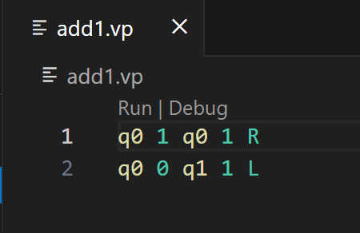
2. When you press the "Run" button (slightly above the first line of your program), you will be prompted to input the path to the Varphi compiler. You should input the path that you copied from step 3 in the command-line installation steps. NOTE: This prompt only happens one time, and then the path is stored. To change it, change the "Varphi: Vpc Path" setting. 
    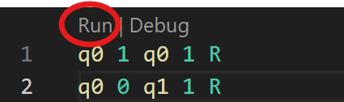
3. Then, you will be prompted to input the input tape. Input "111".
4. Open the Command Palette (Ctrl + Shift + P on Windows, Shift + Command + P on Mac), and input "debug console", and select the following option
    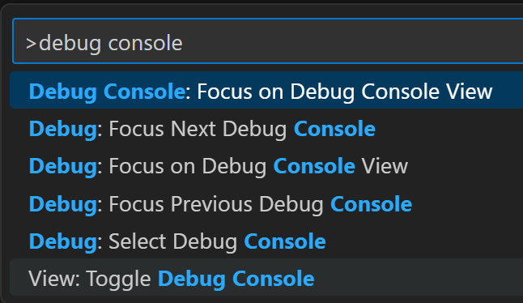
5. The Debug Console should then open, and you will see the output tape that the machine will produce
    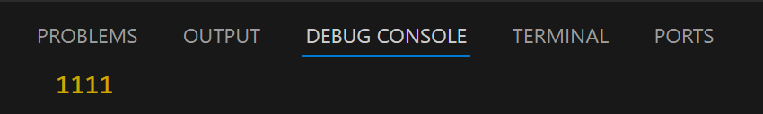

NOTE: The Varphi VS Code extension only supports interpreting your programs, and will not compile them to an executable. To compile your program to an exectuable, please follow Step 3 in [Compiling/Interpreting Programs With the Varphi Compiler](#compilinginterpreting-programs-with-the-varphi-compiler).

### Debugging Programs with the Varphi VS Code Extension

It is very difficult to debug Varphi programs by hand, especially when programs are of larger size. The Varphi VS Code extension provides debug abilities, so that you can step through your code and check values of the tape, head, and state as you step. 

Let's walk through an example of debugging a buggy program. Say we messed up while writing our "add1.vp" program, instead wrote 
```
q0 0 q0 1 R
q0 1 q1 1 R
```

Now run your program on input "111", and see what you get

Seems like the answer is "111". Why is that? Let's debug the program. 

In VS Code, click on the "Debug" button above your code (right beside the "Run" button)

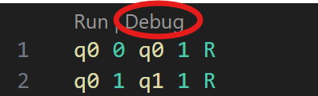

You will be prompted to input the input tape. Input "111".

Then, open the Command Palette and type "show run and debug". Click the following option

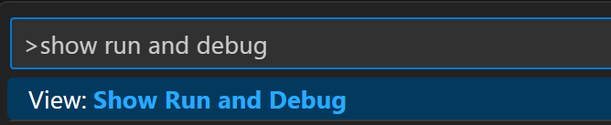

On the left-hand side, the following view should appear

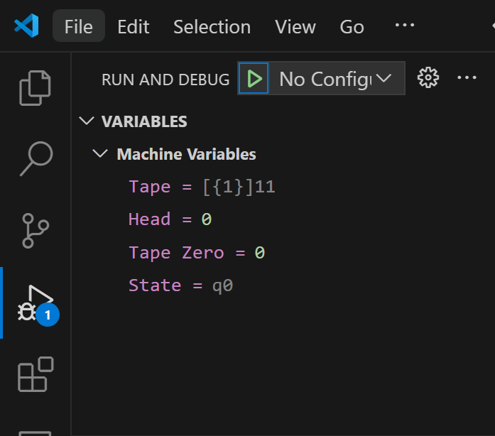

Here's how to read this view:

* The tape's contents are `111`
* The head is at index 0 of the tape (you can tell this by either looking at the "Head" variable, or by seeing which index the square brackets [] surround on the tape)
* The index of the first tally on the input tape is index 0 (you can tell this by either looking at the "Tape Zero" variable, or by seeing which index the square brackets {} surround on the tape). NOTE: The "Tape Zero" will not change as long as the head does not move to the left of the index of the first tally on the input tape. This variable is useful since it gives an "anchor point" for the user to refer to. 
* The current state is `q0`. 

Also, the tab which contains your Varphi program should have Line 2 being highlighted in yellow

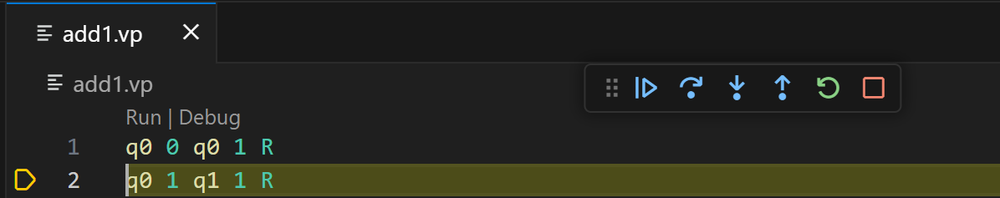

This indicates that Line 2 is about to be executed. Now step through your code by clicking the following icon

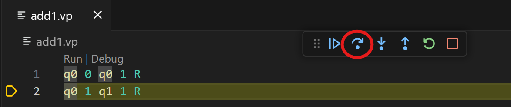

You should see that the code completes execution (no line is highlighted) and you should see the output tape in the Debug Console (refer to Step 4 from [Running Programs with the Varphi VS Code Extension](#running-programs-with-the-varphi-vs-code-extension)) to open the Debug Console. 

So then what is the issue? Well, the final line that executed is line 2
```
q0 1 q1 1 R
```

This states that if the current state is `q0`, and we see a tally, then move to state `q1`, place a tally at the current tape cell, and move the head to the right. But the head was positioned at a tally (since the head always starts at the leftmost cell containing a tally), and since `q1` does not define any rules for tallies or blanks, it is an empty state and so the program terminates right away, leaving the tape is it was originally.

Let's fix the program and debug it again. Paste the correct program into the editor

```
q0 1 q0 1 R
q0 0 q1 1 R
```

Then start debugging again.

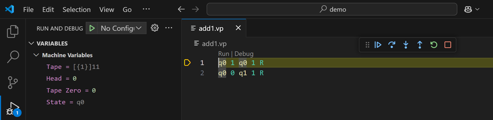

Great! The program starts at the first line. Try stepping, and you should see the head moving to the right

Before stepping:

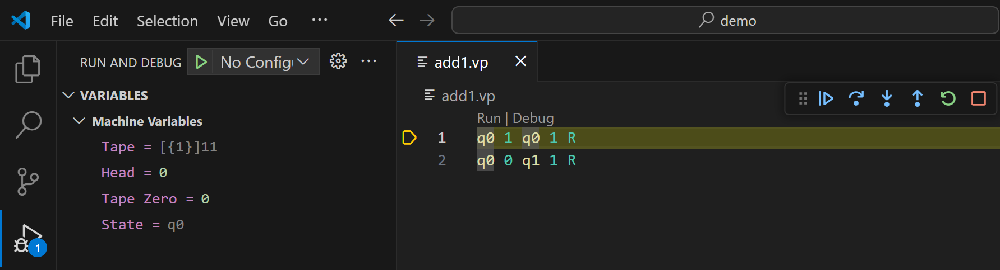

After stepping once:

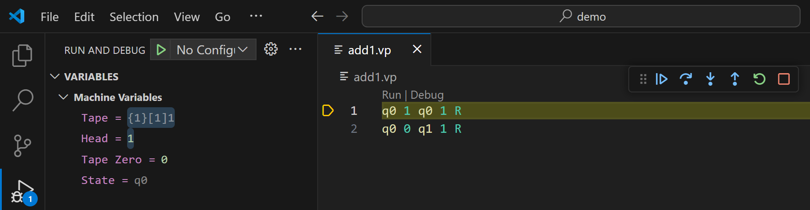

After stepping twice:

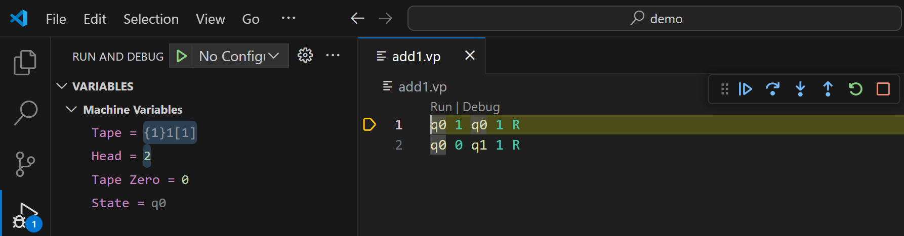

After stepping three times:

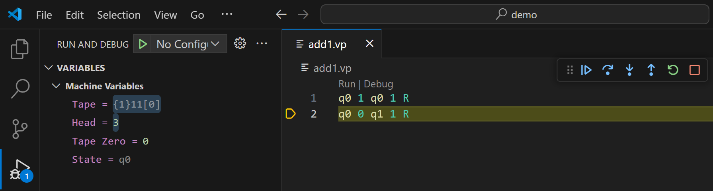

Now the program has encountered a blank at state `q0`. According to the line the execution is stopped at, the head should place a tally at the current tape cell, and the next state should be `q1`, which is empty. Then, the head should move to the right and read a blank (as there are infinite blanks spanning in either direction of the tape) and read that element, but since state `q1` is empty, nothing will happen and the execution will halt. Here's what happens when we step once more

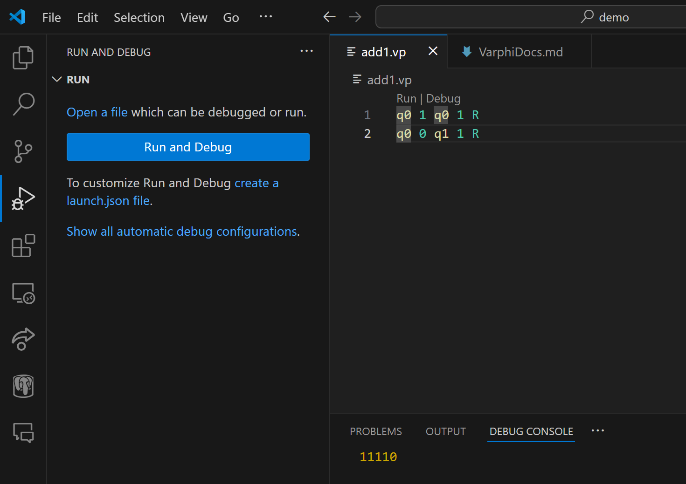

Notice that in the Debug Console, the result is `11110`, which is correct. The `0` at the end is due to the final head read when the state is `q1`, as Varphi will show you all tape elements that were ever read or written to in the execution of the machine. You can avoid this by moving the head to the left on Line 2 instead of to the right.

Finally, one more feature of debugging Varphi programs in VS Code is that you can set breakpoints, which tell the debugger "keep stepping automatically until you reach this line." This can be useful for longer programs that take time to step through. To set a breakpoint at a certain line, move your mouse to the left of that line and press the red circle. For example, if we wanted to set a breakpoint at line 2 of our example program, 

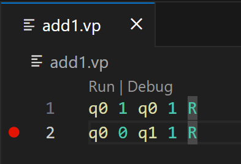

Then, start debugging again. You should see that the first highlighted line is line 2, and that the Machine Variables section shows the machine just as it is about to finish execution

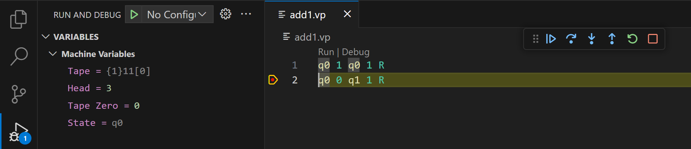
